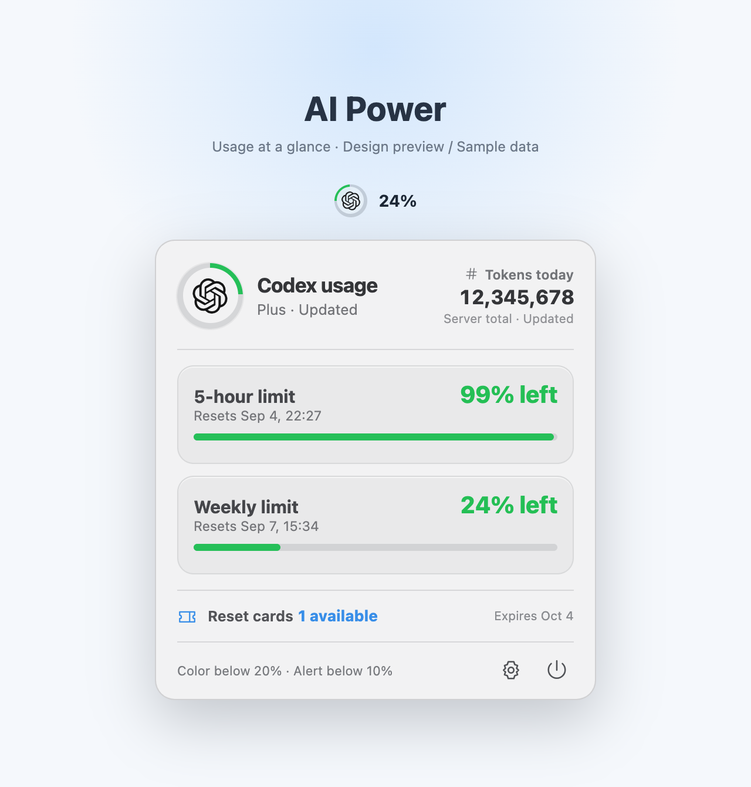

# AI Power

English | [简体中文](README.md)

AI Power is a native macOS menu-bar utility. While the ChatGPT or Codex desktop app is running, it shows the remaining percentage for the longest usage window currently returned by Codex. Click the menu-bar icon to see all available usage windows.

> AI Power is an independent, unofficial project. It is not affiliated with, authorized by, or endorsed by OpenAI.



*The previously approved 1.1 product design preview uses sample numbers and dates. The actual interface and available information depend on the app and server response.*

## Why AI Power?

Seeing your remaining allowance while coding or using AI helps you plan your next tasks. AI Power keeps that information in the menu bar. One click reveals reset times for different usage windows, daily token statistics, and available reset cards.

## Features

- OpenAI mark, colored quota ring, and remaining percentage in the menu bar
- The logo in the popover rotates during refresh, replacing a separate loading spinner
- Dynamic display of 5-hour, weekly, and other independent usage pools returned by the server
- Daily token totals from the latest server response, with the statistics date shown when today's data is unavailable
- Available reset-card count and earliest expiration date (display only; no redemption action)
- Automatic visibility while ChatGPT or Codex is running; hidden after both apps quit
- Refresh on startup, every 60 seconds, and when opening the popover; retain previous data on failure
- Orange below 20%, red below 10%, and one low-usage notification per window cycle
- Chinese and English, following the system or selected manually
- Launch at login, enabled by default on first run and configurable in settings
- Read usage through the local Codex sign-in without collecting passwords or browser cookies

## Download and installation

Download the latest `AI-Power-*-macOS.zip` from [Releases](https://github.com/Rocky918/ai-power/releases).

One Universal 2 archive supports both Intel and M-series Macs. For an update, quit the running AI Power app, then replace the previous version in Applications.

1. Extract the ZIP.
2. Move `AI Power.app` to Applications.
3. On first launch, Control-click the app, choose **Open**, and confirm **Open** again.
4. Launch and sign in to the ChatGPT or Codex desktop app.

Public builds use an ad-hoc signature and are not Apple-notarized, so macOS may display a developer-verification prompt on first launch. If Control-click → Open is still blocked, go to **System Settings → Privacy & Security → Open Anyway**.

## Compatibility

- macOS 13 or later
- Universal 2: Apple silicon (M-series, `arm64`) and Intel (`x86_64`)
- Requires an installed and signed-in ChatGPT/Codex desktop app

## Usage and data

- Start AI Power and keep ChatGPT or Codex running. Click the menu-bar quota ring to open the details.
- The menu bar shows the longest usage window currently returned by the server. It is not fixed to a month; subscription billing and usage reset cycles are different.
- Daily token statistics come from the server and may be delayed. If today's data is missing, the latest statistics date is shown. This is not a real-time local token counter.
- Reset cards show only the available count and earliest expiration. There are no redeem or purchase buttons. If the server does not supply this field, the app shows `--`.
- Use settings to change the interface language or launch-at-login preference. The menu item hides after both ChatGPT and Codex quit.

## Privacy

AI Power calls only usage-reading methods through the local Codex app-server. It does not collect, upload, or store passwords, browser cookies, access tokens, or chat content.

Usage data stays in memory. Local preferences store the language, launch-at-login setting, and notification markers. The local Codex app-server communicates with OpenAI using the existing sign-in.

## Build from source

This is a standard Swift Package. Open `Package.swift` directly in Xcode.

Build a Universal 2 archive from the command line:

```shell
zsh Scripts/package.sh
```

Artifacts are written to `dist/`. The script builds `arm64` and `x86_64` separately, then combines them into a Universal 2 app using `lipo`.

Run the core self-test:

```shell
swift run AIPowerCoreSelfTest
```

## License and trademarks

Source code is licensed under the [MIT License](LICENSE). `OpenAILogo.svg` and the OpenAI name and logo are not covered by this MIT license. Those trademarks belong to OpenAI and are used to identify the service this utility connects to.
