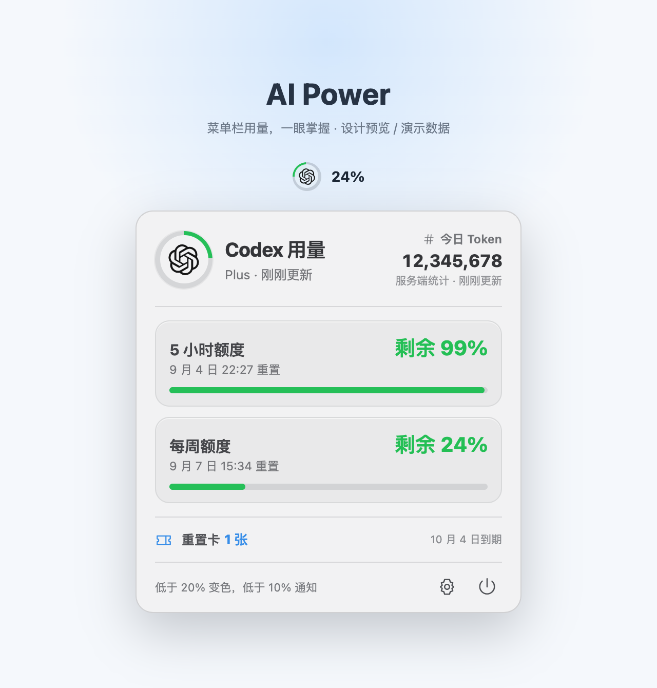

# AI Power

[English](README.en.md) | 简体中文

AI Power 是一款原生 macOS 菜单栏工具。当 ChatGPT 或 Codex 桌面应用运行时，它会显示当前最长用量周期的剩余百分比，并在弹窗中列出 Codex 实际返回的全部用量周期。

> AI Power 是非官方独立项目，与 OpenAI 无隶属、授权或背书关系。



*此前确认的 1.1 产品设计预览，图中数字和日期均为演示数据；实际界面及可用信息以应用和服务端返回为准。*

## 为什么需要 AI Power？

在写代码或使用 AI 时，随时查看剩余额度，可以更方便地安排接下来的工作。AI Power 把余量放在屏幕顶部，点击即可查看不同周期的重置时间、每日 Token 统计和重置卡数量。

## 功能

- 菜单栏 OpenAI 标志、彩色余量环和剩余百分比
- 刷新时由详情页 OpenAI 标志旋转提示，不再额外显示加载转圈
- 动态显示服务端返回的 5 小时、每周及其他独立额度池
- 显示服务端最近返回的每日 Token 活动总量；当日数据尚未生成时明确标注统计日期
- 显示当前可用的额度重置卡数量及最早到期时间（仅展示，不提供消耗操作）
- 自动识别 ChatGPT/Codex 运行状态，关闭后隐藏
- 启动、每 60 秒及打开弹窗时刷新；失败时保留上次数据
- 剩余量低于 20% 显示橙色，低于 10% 显示红色并按周期通知一次
- 中文/英文跟随系统，也可手动切换
- 登录时启动（首次运行默认开启，可在设置中关闭）
- 所有数据均通过本机 Codex 登录状态读取，不获取密码或浏览器 Cookie

## 下载与安装

**1.1.1 修复了旧版在其他 Mac 上因资源包路径错误而启动崩溃的问题。** 已安装 1.1.0 的用户请下载最新版本替换。

从 [Releases](https://github.com/Rocky918/ai-power/releases) 下载最新的 `AI-Power-*-macOS.zip`。

一个 Universal 2 安装包同时支持 Intel 和 M 系列芯片，无需分别下载。更新时先退出正在运行的 AI Power，再用新版替换“应用程序”里的旧版。

1. 解压 ZIP。
2. 将 `AI Power.app` 拖入“应用程序”文件夹。
3. 首次启动时右键应用并选择“打开”，再确认一次“打开”。
4. 启动并登录 ChatGPT 或 Codex 桌面应用。

由于公开版本采用 ad-hoc 临时签名且未经过 Apple 公证，macOS 首次运行时会显示开发者验证提示。若右键打开仍被阻止，请前往“系统设置 → 隐私与安全性”选择“仍要打开”。

## 兼容性

- macOS 13 或更高版本
- Universal 2：同时支持 Apple Silicon（M 系列，`arm64`）与 Intel（`x86_64`）
- 需要已安装并登录 ChatGPT/Codex 桌面应用

## 使用与数据说明

- 启动 AI Power，并保持 ChatGPT 或 Codex 桌面应用运行；点击菜单栏余量环即可打开详情。
- 菜单栏默认显示服务端当前返回的最长额度周期，不固定为月；订阅扣费周期不等于用量重置周期。
- 每日 Token 来自服务端统计，可能延迟。缺少当天数据时会显示最近统计日期；它不是本机实时 Token 计数器。
- 重置卡仅展示可用数量和最早到期时间，没有使用或购买按钮。服务端不提供该字段时显示 `--`。
- 在设置中切换中文/英文或调整登录时启动；退出 ChatGPT 和 Codex 后，菜单项自动隐藏。

## 隐私

AI Power 只调用本机 Codex app-server 的用量读取接口。应用不会收集、上传或保存密码、浏览器 Cookie、访问令牌或聊天内容。

用量数据保存在运行内存中；本地偏好设置记录语言、登录启动选项和通知标记。本机 Codex app-server 使用已有登录状态与 OpenAI 通信。

## 从源码构建

项目是标准 Swift Package，可直接在 Xcode 中打开 `Package.swift`。

命令行构建 Universal 2 安装包：

```shell
zsh Scripts/package.sh
```

产物会生成在 `dist/`。打包脚本分别构建 `arm64` 和 `x86_64`，再使用 `lipo` 合并成 Universal 2 应用。

运行核心自测：

```shell
swift run AIPowerCoreSelfTest
```

验证发布 ZIP 在无法访问开发目录时仍能加载 Logo 和中英文资源（macOS，需要 Python 3）：

```shell
python3 Scripts/check-packaged-resources.py dist/AI-Power-1.1.1-macOS.zip
```

该检查还会验证缺少包内资源时不会误用开发目录。1.1.1 已在 Intel Mac 完成隔离启动测试；ARM 已通过构建和签名检查，Apple Silicon 实机复测尚待完成。

## 许可证与商标

源代码采用 [MIT License](LICENSE)。`OpenAILogo.svg` 及 OpenAI 名称和标志不包含在 MIT 授权中；相关商标归 OpenAI 所有，仅用于标识本工具所连接的服务。
